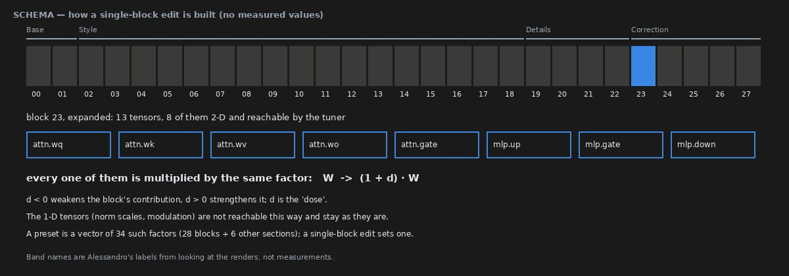

# The edit, the instrument, and what a result had to pass

> **Holds** · 28 renders · integrity checks, criteria fixed before the values
> [← all results](README.md#what-holds-and-what-does-not)

> **The direction I'm chasing.** Before asking whether a block of weights is a knob, I need to
> know that the edit does only what I say it does, that the same render comes out twice, and
> that my own eye — the main instrument of this project — is described honestly.
>
> **What would kill it.** A tuner that changes the picture at zero, a re-render that differs by
> a single pixel value, or an eye pass presented as blind when it was not.
>
> **Where we are.** The pipeline is deterministic and the tuner is inert at zero, checked again
> before every confirmatory bench. The eye is not blind and is declared as such; every image it
> judged is published.

## In two minutes

Krea-2 is a diffusion transformer with 28 single-stream blocks. Each block holds 13 weight
tensors; eight of them are 2-D matrices (attention projections and the MLP), and the tuner
reaches those eight. An edit in this report is one number per block: the block's eight matrices
are multiplied by 1 + d, where d is the signed dose. Nothing is trained, nothing is added at
inference, and a preset is just a vector of such numbers.


Three blocks, three different kinds of change: colour, what is depicted, softness. The rest of
this report asks how far such a change can be trusted to be the same on another picture.



The same sampling is used throughout: euler_ancestral, simple scheduler, 9 steps, CFG 1.0,
1024×1280. Every result in this folder went through the same sequence: an observation by eye on
an exploratory bench, a claim written down, a pre-registration with its decision rule and its
scoring code committed, a reproduction check, the renders, my eye pass deposited in the
repository, and only then the numbers.

## The verdict

The instrument does what it says. With the tuner in the graph and every gain at zero the render
is the render without the tuner, bit for bit; renders reproduce exactly across restarts and
across benches, and that was checked again, on 28 images, before each of the three confirmatory
benches in this report. The eye pass that every result here leans on is not blind, and is
reported as made by one observer who knew the conditions.

## Why I might be wrong

* **Determinism is checked on one machine and one software stack.** Another GPU, driver or
  ComfyUI version may not reproduce these files bit for bit; the effects should survive that,
  the exact pixels may not.
* **The model file's hash is not recorded.** It sits outside the repository.
* **The tuner's version is not recorded** in the reproducibility blocks; it is a separate
  repository.
* **Doses were calibrated by eye, per block, on single images.** They are not calibrated
  displacements, and page 23 shows that some of them are too strong for a preset.

## The data

### The edit

The tuner node (`ArthemyKrea2ModelTuner`, Real Value mode, preceded by `ArthemyKrea2ResetPatcher`)
takes a 34-slot vector; slot *k* is the dose of block *k* for k = 0 … 27. Only the 2-D tensors
are scaled: the 1-D norm scales are never reached, so they cannot carry an effect
([`docs/normscales_never_applied.md`](https://github.com/aledelpho/diffusion-models-weight-steering-report/blob/97134a26a0700d864903e87cc3d81386318c244f/docs/normscales_never_applied.md)). Doses are small — between 0.075 and 0.45 in this report —
and differ by block, because a block near the output breaks at a dose a middle block barely
feels ([`docs/RENDERS_2026-09-30_single_blocks_styles.md`](https://github.com/aledelpho/diffusion-models-weight-steering-report/blob/97134a26a0700d864903e87cc3d81386318c244f/docs/RENDERS_2026-09-30_single_blocks_styles.md)).

### The same render twice

| check | where | result |
|---|---|---|
| tuner at zero against no tuner | notebook page 00, 15 cells, 3 prompts | max channel difference **0** |
| same render across a restart | notebook page 00 | max channel difference **0** |
| wording bench, first row against the prompt-order baseline | `benchmark_prompt_writing` | **1 / 1** identical |
| saturation bench, rows already on older benches | `benchmark_blk23_colorful` | **26 / 26** identical |
| prompt-family bench, first row against the styles baseline | `benchmark_prompt_family` | **1 / 1** identical |

Each reproduction row was queued alone first and compared before the rest of the bench was
allowed to run. The outputs of the checks are in the render notes listed under Provenance.

### Why the eye pass is declared open

In notebook page 03, a pre-registered round asked me to tell which edit produced an image whose
filename was a hash. I was right 17 times in 20 on one condition and 12 in 20 on the other,
against 5 in 20 by chance. Hiding names does not hide an edit with a visible signature from
someone who has looked at hundreds of them. So every eye pass in this report is declared as
made with the condition known, it is deposited in `data/` before the numbers are computed, and
all the images are published so that anyone can repeat it.

### The measures

* **Style features** — 23 statistics of texture, edges and colour per image
  ([`experiments/style_features.py`](https://github.com/aledelpho/diffusion-models-weight-steering-report/blob/97134a26a0700d864903e87cc3d81386318c244f/experiments/style_features.py)); an arm's effect is its vector of changes from the
  baseline.
* **Colour and layout** — CIELAB at 64×80: mean chroma change, and layout r, the correlation of
  the lightness channel with the baseline.
* **Standard metrics** — BRISQUE, CLIP-IQA, CLIPScore, LPIPS, DISTS, SSIM and DINOv2 cosine
  (page 25).

When a statistic and the eye disagree, the statistic is suspected first: twice in this project a
statistic ranked destroyed images as the best (page 26).

### Reproducing this

```yaml
model:
  checkpoint: krea2_turbo_bf16.safetensors
  weight_dtype: default
  sha256: not recorded — the file is outside the repository
sampling:
  sampler: euler_ancestral
  steps: 9
  cfg: 1.0
  denoise: 1.0
  scheduler: simple
  resolution: 1024x1280
  vae: qwen_image_vae.safetensors
  text_encoder: qwen3vl_4b_bf16.safetensors (CLIPLoader type krea2)
tuner:
  node: ArthemyKrea2ModelTuner, after ArthemyKrea2ResetPatcher
  version: not recorded — the tuner is a separate repository
  mode: Real Value, driven by a 34-slot vectors_override
prompts:
  files: [data/prompt_writing_plan.csv, data/blk23_colorful_plan.csv, data/prompt_family_plan.csv]
  ids: [V1_Original, E1_cartoon, E3_oil, E7_sepiaphoto, C2_rally, C3_fox, C4_stilllife, P3_archerforest, P4_selfie, REPRO_C3_fox]
seeds: [3141592, 2718281, 1618033, 4669201]
conditions:
  - name: repro_baseline
    dose: 0
    measured_D: 0 (no edit)
  - name: repro_b23
    dose: "-0.300, +0.150, +0.300 on block 23"
    measured_D: not measured; the dose is a per-block gain, not a calibrated displacement
outputs:
  folders: [benchmark_prompt_writing, benchmark_blk23_colorful, benchmark_prompt_family]
  manifest: data/prompt_writing_plan.csv, data/blk23_colorful_plan.csv, data/prompt_family_plan.csv
analysis:
  scripts:
    - experiments/check_prompt_writing_repro.py  # 170a82a27b99ef708b314890096f01bf0d21c14e7c4c27b4ed866a83deca28c7
    - experiments/blk23_colorful.py --repro      # cbfc0f8354fdc869d400b7d45c698f6828e1dd04835def28f4ecd9da09154924
    - experiments/prompt_family.py --repro       # 67fc54ec7a5fdce93dd86ea0190378f230bfcfac00e731843a2d2e4d4c69b427
  criterion: maximum absolute pixel difference 0
```

## Provenance

* **Renders.** benchmark_prompt_writing (1), benchmark_blk23_colorful (26), benchmark_prompt_family (1).
* **Check outputs:** [`docs/RENDERS_2026-10-04_prompt_writing.md`](https://github.com/aledelpho/diffusion-models-weight-steering-report/blob/97134a26a0700d864903e87cc3d81386318c244f/docs/RENDERS_2026-10-04_prompt_writing.md),
  [`docs/RENDERS_2026-10-04_blk23_colorful.md`](https://github.com/aledelpho/diffusion-models-weight-steering-report/blob/97134a26a0700d864903e87cc3d81386318c244f/docs/RENDERS_2026-10-04_blk23_colorful.md), [`docs/RENDERS_2026-10-04_prompt_family.md`](https://github.com/aledelpho/diffusion-models-weight-steering-report/blob/97134a26a0700d864903e87cc3d81386318c244f/docs/RENDERS_2026-10-04_prompt_family.md).
* **Earlier integrity checks:** [notebook page 00](https://github.com/aledelpho/diffusion-models-weight-steering-report/blob/97134a26a0700d864903e87cc3d81386318c244f/notebook/00-the-bench.md) (tuner at zero,
  determinism, noise floor); [notebook page 03](https://github.com/aledelpho/diffusion-models-weight-steering-report/blob/97134a26a0700d864903e87cc3d81386318c244f/notebook/03-what-ends-up-in-the-picture.md)
  (the blinding round).
* **Model structure:** [`docs/model_structures/`](https://github.com/aledelpho/diffusion-models-weight-steering-report/blob/97134a26a0700d864903e87cc3d81386318c244f/docs/model_structures/), [`docs/normscales_never_applied.md`](https://github.com/aledelpho/diffusion-models-weight-steering-report/blob/97134a26a0700d864903e87cc3d81386318c244f/docs/normscales_never_applied.md).
