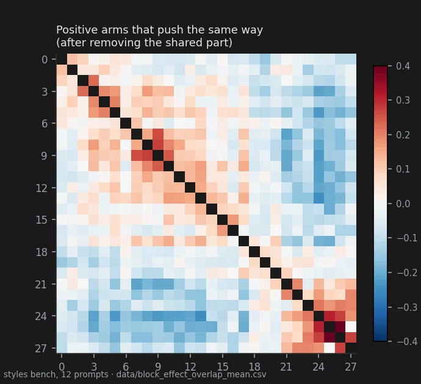
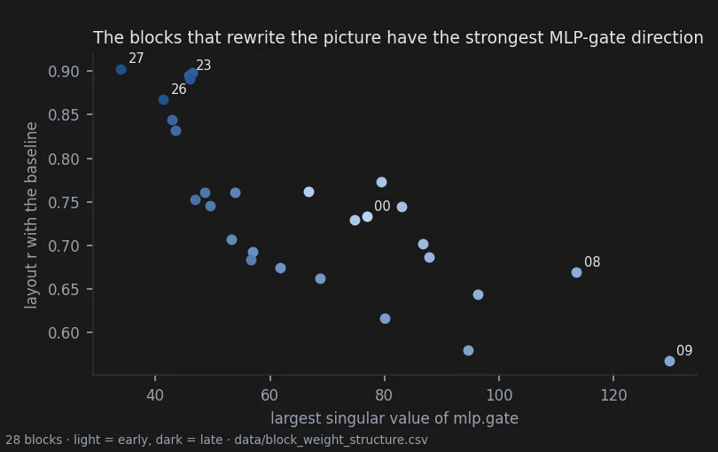

# A map of the 28 blocks

> **Open** · 1412 renders · exploratory map, one pre-registered test on the weights
> [← all results](README.md#what-holds-and-what-does-not)

> **The direction I'm chasing.** If knobs live in the weights, they should live in particular
> places. I pushed every block on its own, in both directions, on 23 prompts, and wrote down
> what each one does, so that the confirmatory tests on the other pages had somewhere to aim.
>
> **What would kill it.** A stack where every block does a bit of everything, with no region
> that behaves differently from the others and nothing that comes back on a second set of
> prompts.
>
> **Where we are.** The two ends behave like controls on the surface of the picture; the middle
> rewrites what is depicted. A few groups of neighbouring blocks push the same way on a second
> set of prompts. This page is a map, not a test: only the weights claim was pre-registered,
> and it passed by a thin margin.

## In two minutes

The atlas behind this page is three benches — 12 prompts in eight styles, 6 prompts at two
seeds, 5 prompts with comic pages and crowns seen from above — with every block pushed on its own
in both directions at a dose I calibrated by eye. Looking at the sheets, the stack sorts itself
into four bands: Base (00–01, grain and detail), Style (02–18, light, form, abstraction), Details
(19–22) and Correction (23–27: saturation, sharpness, grain). My block-by-block definitions are
in `data/single_blocks_v4_definitions_alessandro.md`.


What the eye saw first was a split between blocks that redraw and blocks that re-shoot. Blocks
02–07 pushed positive keep frame, pose and props and redraw the subject (a younger face, a
cleaner line, smoke over the forge). Blocks 08–09 pushed positive change the picture itself: a
crown seen from above turns to a side view, the blacksmith becomes a photograph, the selfie
changes identity.

## The verdict

The ends of the stack are where a single block behaves like a surface control: the layout stays,
and colour, grain or sharpness move. The middle is where single blocks change content — viewpoint,
identity, medium — and are least predictable. A few groups of neighbouring blocks push in the
same direction on a second set of prompts. The split between stable and unstable blocks is
partly visible in the weights themselves, but that result is marginal.

## Why I might be wrong

* **This is a map, drawn after looking.** The bands are my reading of the sheets; only the
  weights test (C46) was frozen before the data.
* **The doses differ by block and by bench.** A block that looks stable may have been pushed less.
* **64×80 sees layout and colour, not grain.** The groups say nothing about blocks 00, 01, 21, 26
  and 27, whose effects are fine texture.
* **The replication of the groups is weak.** Second set of prompts, other seeds and doses, but
  the groups were chosen after seeing the first set and the measure was the same.
* **The weights result rests on n = 28** and one checkpoint, and a single block can flip it.
* **The guide to each block is one observer's shorthand.** It was written from a few prompts, at
  one dose per direction, by someone who knew which block he was looking at. Several entries are
  simplifications, some will turn out to be wrong, and the effect of many Style-band blocks
  changes with the prompt.

## The data

### Where the layout holds

Layout r is the correlation of the lightness channel with the baseline at 64×80 (1 = the same
composition), averaged over 23 prompts and both signs (`data/block_colour_layout.csv`):

| blocks | 00–01 | 02–04 | 05–14 | 15–20 | 21–27 |
|---|---|---|---|---|---|
| layout r | 0.75 | 0.75 | 0.65 | 0.73 | 0.88 |

The bands hold at the two ends and blur in the middle; the sharpest break is at the Correction
end, not between Style and Details. Positive pushes of blocks 08, 09 and 10 are the least stable
of all (0.55, 0.46, 0.51). This agrees with two pre-registered results of the exploratory
notebook: [every push costs fine texture and the cost grows toward the output](https://github.com/aledelpho/diffusion-models-weight-steering-report/blob/3886aab18615eadc21362034a8d7c03e1cdc00d7/notebook/05-knob-or-cost.md),
and [two places pushed the same distance move the picture in distinguishable directions](https://github.com/aledelpho/diffusion-models-weight-steering-report/blob/3886aab18615eadc21362034a8d7c03e1cdc00d7/notebook/08-block1-vs-block6.md)
— position, not only distance, decides what an edit does.

### Blocks that push together

For each pair of arms on the same prompt, the change each makes to the picture is correlated
pixel by pixel after removing the prompt's common mode — the part of the change that every edit
shares, simply because any edit moves the picture away from that particular baseline. Before
removal the two signs of one block correlate positively on 27 of 28 blocks; after it, negatively
on 25 of 28.



| group | styles, 12 prompts | other benches, 11 prompts |
|---|---|---|
| 08 · 09 · 10, positive | +0.24 to +0.27 | +0.15 to +0.23 |
| 23 · 24 · 25 · 26, positive | +0.21 to +0.51 | +0.23 to +0.37 |
| 15 · 16, positive | +0.17 | +0.21 |
| 02 · 03 · 04 · 05, positive | +0.19 to +0.23 | +0.01 to +0.14 — **does not come back** |
| block 05 against block 24, positive | −0.23 | −0.22 |

Negative arms 22–27 form one group as well (most pairs +0.19 to +0.54). Blocks 25 and 26 are
the exceptions where both signs push the same way even after removal — the two blocks I had
already marked as damaging in both directions. The tuner's six macro-block sliders (`Block_1` …
`Block_6`, each a run of consecutive blocks) cut across two of these groups: 08–10 straddles
`Block_2`/`Block_3` and 23–26 straddles `Block_5`/`Block_6`. A single block is the finer lever.

### What the weights show

A pre-registered test (C46) asked whether any of 34 statistics of a block's weight matrices
tracks how much the block rewrites the picture, beyond what depth alone explains. The
analyst's registered prediction was that depth would explain everything; it failed.



| statistic | ρ raw | ρ with depth removed |
|---|---|---|
| `mlp.down.sigma1` | −0.41 | **−0.615** |
| `mlp.gate.stable_rank` | +0.53 | **+0.613** |
| `mlp.down.stable_rank` | −0.36 | **+0.585** |

Three statistics pass the Bonferroni threshold of 0.57; leaving one block out keeps them between
0.50 and 0.70. Two readings are worth recording. Blocks 08–09 have the strongest single direction
in their MLP gate in the stack (σ₁ 113 and 130 against 34–97 elsewhere). Blocks 26–27 write
through almost one direction (stable rank of the attention output 26 and 13 against 100–260
elsewhere), which is one mechanical reading of a knob. Block 23, the saturation knob of page 22,
does not stand out on any of the 40 values.

### A starting guide: what each block seems to do

> **Read this as a map drawn by hand, not a measurement.** I wrote it while looking at the v4
> bench — four crowns and one comic page at seed 1234567 — on a page that also showed the 18
> prompts of the styles and v3 benches. Each entry is the change I found most evident; Style-band
> blocks do many other things. It is provisional and meant to be expanded and corrected. Its use
> is practical: where to start, roughly where "style" begins, and what to expect from each
> block in each direction.

Doses are those of the v4 bench (`data/block_colour_layout.csv`, rows `v4`); they are where
these effects were seen, not safe defaults, and page 23 shows that doses chosen on single images
can be too strong for a preset.

| block | dose − / + | negative | positive |
|---|---|---|---|
| **Base** | | | |
| 00 | −0.20 / +0.25 | more grain, detail, colour variety, colour confetti | soft and hazy: less grain, detail and colour variety |
| 01 | −0.40 / +0.25 | softer colours, subtle textures | patchy colour, flat tints, more grain and detail (the opposite of 00) |
| **Style** | | | |
| 02 | −0.45 / +0.40 | fine textures and micro-detail; less camera control | flat fills, toward close-up, more camera control, colour blocks |
| 03 | −0.55 / +0.40 | less natural, less three-dimensional light | natural, three-dimensional light (changes a lot with the prompt) |
| 04 | −0.55 / +0.55 | fine-grained detail, less abstraction | coarse, merged detail; simplification and abstraction |
| 05 | −0.55 / +0.55 | darker, dirtier, messier | brighter, cleaner |
| 06 | −0.55 / +0.55 | more volume, more organic; fewer colours, less stylisation | more colour, more stylised and artificial; less volume |
| 07 | −0.55 / +0.55 | elements blend less (less concept bleeding), fewer deformations | elements blend more (more concept bleeding), more deformations |
| 08 | −0.55 / +0.55 | more expression and natural poses; less texture realism, less flattening | more texture realism, deformation and flattening; less expression |
| 09 | −0.55 / +0.55 | less realism of volumes and materials | more realism of volumes and materials |
| 10 | −0.45 / +0.45 | more expression (varies with the prompt) | less expression |
| 11 | −0.45 / +0.45 | more camera control, style emphasised; less deformation | more deformation and abstraction; camera control and style lost |
| 12 | −0.45 / +0.40 | more camera control, perspective, imperfections; less deformation | more deformation; less camera control, perspective, imperfections |
| 13 | −0.45 / +0.40 | organic | geometric |
| 14 | −0.55 / +0.40 | details more distinct; less colour contrast, less texture depth | more colour contrast and texture depth; details less distinct |
| 15 | −0.45 / +0.40 | more depth (light, shadow, reflections, translucency), more realistic detail | less depth (simplified, flattened subjects), less realistic detail |
| 16 | −0.45 / +0.30 | more complex textures, more detail, less abstraction | muffled textures, fewer details, more abstraction |
| 17 | −0.45 / +0.40 | less synthesis: less stylised, closer to the prompt | more synthesis: simpler, further from the prompt |
| 18 | −0.45 / +0.30 | more depth and volume | less depth and volume |
| **Details** | | | |
| 19 | −0.45 / +0.25 | subjects shaped by form, more complex detail | subjects shaped by light, less complex detail |
| 20 | −0.55 / +0.45 | parts of the subject blend together | parts of the subject separate, more distinct in colour |
| 21 | −0.45 / +0.25 | finer grain of detail and imperfection | coarser, accentuated grain of detail and imperfection |
| 22 | −0.45 / +0.25 | sharpens and flattens textures | blurs and softens textures (borders on Correction) |
| **Correction** | | | |
| 23 | −0.30 / +0.30 | more saturation | less saturation (page 22) |
| 24 | −0.40 / +0.20 | more colour contrast (flatter, more distinct colours), harsher textures | less colour contrast (softer, more complex colours), gentler textures |
| 25 | −0.45 / +0.25 | less colour blur | more colour blur (damaging in both directions on other benches) |
| 26 | −0.25 / +0.15 | fewer fine textures | more fine texture, adds grain |
| 27 | −0.25 / +0.05 | blurs and darkens | adds grain and lightens, like an aggressive sharpen filter |

Where a measurement touches an entry ([`docs/block_groups_and_prompt_order.md`](https://github.com/aledelpho/diffusion-models-weight-steering-report/blob/3886aab18615eadc21362034a8d7c03e1cdc00d7/docs/block_groups_and_prompt_order.md) §4, on the
prompt-order images): the statistics agree on 00, 22, 23 and 27; on 01 "opposite of 00" holds for
grain and detail but not for the whole effect; on 26 the spectral statistic says the opposite, and
a 1:1 crop sides with the description — what reads as grain is a mosaic of colour cells. On page
23, blk09 + raised realism by eye on every family, as the guide says; blk17 + read on photographs
as "focus on the subject", which the guide does not anticipate. The other Style-band entries have
not been measured.

### Reproducing this

```yaml
model:
  checkpoint: krea2_turbo_bf16.safetensors
  weight_dtype: default
  sha256: not recorded — the file is outside the repository
sampling:
  sampler: euler_ancestral
  steps: 9
  cfg: 1.0
  denoise: 1.0
  scheduler: simple
  resolution: 1024x1280
  vae: qwen_image_vae.safetensors
  text_encoder: qwen3vl_4b_bf16.safetensors (CLIPLoader type krea2)
tuner:
  node: ArthemyKrea2ModelTuner, after ArthemyKrea2ResetPatcher
  version: not recorded — the tuner is a separate repository
  mode: Real Value, driven by a 34-slot vectors_override (one block at a time)
prompts:
  measured_on: data/block_colour_layout.csv (12 styles prompts, 6 v3 prompts, 5 v4 prompts)
seeds: [2718281, 3141592, 1618033, 1234567]
conditions:
  - name: single block, negative dose, each of 28 blocks
    dose: calibrated by eye per block and per bench
    measured_D: not measured; the dose is a per-block gain, not a calibrated displacement
  - name: single block, positive dose, each of 28 blocks
    dose: calibrated by eye per block and per bench
    measured_D: not measured
outputs:
  folders: [benchmark_single_blocks_styles, benchmark_single_blocks_v3, benchmark_single_blocks_v4]
  manifest: no single committed manifest for all three benches; data/block_colour_layout.csv lists every measured image
analysis:
  scripts:
    - experiments/block_colour_layout.py        # 9b9aea19f1d6f43920cf0cc832d4be23063815d3290723cc4dd7e3bc27147de1
    - experiments/block_effect_overlap.py       # 29853a9f70e6f86987c119d0f74112517cf56e92a3754cb6cf212ca32c4ae188
    - experiments/block_weight_structure.py     # 1df6cc4b4cedf27e99efba52f19cf7318b7a5572f228e53abcd17e900e405645
  produces: data/block_colour_layout.csv, data/block_effect_overlap_mean.csv, data/block_weight_structure.csv, data/block_weight_structure_test.csv
```

## Provenance

* **Renders.** benchmark_single_blocks_styles (684), benchmark_single_blocks_v3 (396), benchmark_single_blocks_v4 (332).
* **Pre-registration (weights only):** [`docs/prereg_block_weight_structure.md`](https://github.com/aledelpho/diffusion-models-weight-steering-report/blob/3886aab18615eadc21362034a8d7c03e1cdc00d7/docs/prereg_block_weight_structure.md), committed before
  any weight was read.
* **Result documents:** [`docs/block_groups_and_prompt_order.md`](https://github.com/aledelpho/diffusion-models-weight-steering-report/blob/3886aab18615eadc21362034a8d7c03e1cdc00d7/docs/block_groups_and_prompt_order.md),
  [`docs/single_blocks_exploration_synthesis.md`](https://github.com/aledelpho/diffusion-models-weight-steering-report/blob/3886aab18615eadc21362034a8d7c03e1cdc00d7/docs/single_blocks_exploration_synthesis.md), [`docs/block_weight_structure_result.md`](https://github.com/aledelpho/diffusion-models-weight-steering-report/blob/3886aab18615eadc21362034a8d7c03e1cdc00d7/docs/block_weight_structure_result.md).
* **Observations:** `data/single_blocks_v4_definitions_alessandro.md` (the original, in Italian, of the guide to each block).
