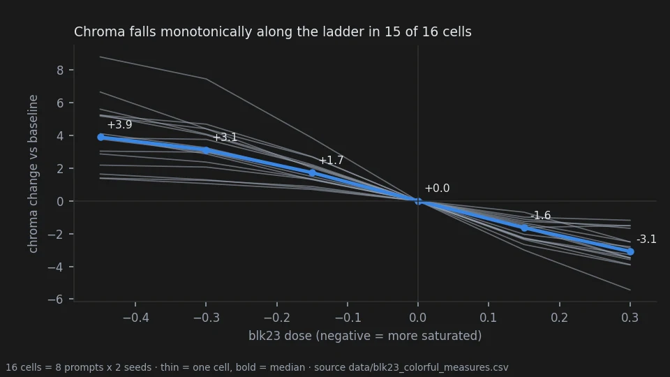
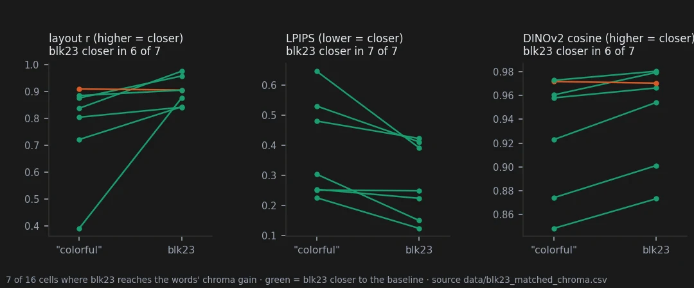

# One block that turns saturation up and down

> **Holds** · 128 renders · 8 prompts · pre-registered 2026-10-04
> [← all results](README.md#what-holds-and-what-does-not)

> **The direction I'm chasing.** If the weights hold knobs, one of them should do one thing
> everywhere. Block 23 looked like a saturation control on every bench where I pushed it, and
> I wanted to know whether it could replace the words people type to get colour.
>
> **What would kill it.** Colour moving the wrong way, or not growing with the dose, on more
> than two of sixteen prompt-seed pairs — or the words "colorful" disturbing the picture less
> than the block at the same colour gain.
>
> **Where we are.** The knob is real and gentle. It moves colour the right way almost
> everywhere and touches the rest of the picture less than the words do, but on half the
> prompts the words simply reach further.

## In two minutes

Krea-2 has 28 transformer blocks. Multiplying the weights of block 23 by a little more than
one lowers the saturation of the picture; by a little less than one, raises it. I rendered
eight prompts — a cartoon elf, an oil-painted elf, a sepia photograph, a rally car, a fox, a
still life, an archer, a selfie — at two seeds each, along a ladder of five doses, and next to
the same prompts with "colorful, vivid highly saturated colors" or "muted colors, desaturated,
low saturation" added to the text.


Read the sheet by columns. Along the ladder the picture stays the same picture and only its
colour moves. The second column is what the words do: the cartoon elf turns blonde and is
redrawn, the still life gains a cut lemon and a pink table. The words do more — more colour and
more of everything else.

## The verdict

Block 23 is a saturation knob: monotone on 15 of 16 cells and roughly proportional to the dose.
At the same colour gain it disturbs the picture less than the words, on every standard metric
tried. It is a gentle knob — on 9 of 16 cells the words reach more colour than the block at its
strongest tested dose — and its desaturating side is weaker and less clean than its saturating
one.

## Why I might be wrong

* **One observer, not blind.** The eye pass is mine, and I knew which column was which. All 128
  images are published so anyone can look.
* **The matched comparison rests on 7 cells.** The pre-registration set no minimum number of
  scorable cells. Nine cells could not be compared because the words went beyond the ladder.
* **Measures of "the rest of the picture" are imperfect.** Layout r sees small shifts the eye
  does not call a change of content; LPIPS and DINOv2 agree with it here, but all three are
  coarse.
* **One wording per direction.** Other phrasings, or the words at the start of the prompt, may
  behave differently.
* **The desaturating side has side effects** I marked by eye on 8 of 16 cells: softening, and on
  the selfie a skin that turns greenish.

## The data

### How it was measured

Each image is compared with the baseline of the same prompt and seed in CIELAB at 64×80:
mean chroma change, and layout r, the correlation of the lightness channel with the baseline.
The words are matched to the ladder by linear interpolation of chroma between rungs; layout r,
LPIPS and DINOv2 cosine are interpolated at the same point.

### Direction and proportion




| test | registered threshold | result |
|---|---|---|
| chroma falls strictly along the ladder | ≥ 14 of 16 | **15 of 16** |
| gain at -0.30 over gain at -0.15, median | 1.6 – 2.4 | **1.76** |

The one exception is the sepia photograph at seed 4669201, where +0.15 and +0.30 remove almost
the same colour (−1.62, −1.51). Before this bench, every render with a blk23 arm in the
repository — 83 images across five benches — already moved chroma the expected way
(`data/blk23_saturation_all.csv`).

### Against the words



| | median over 16 cells | layout r |
|---|---|---|
| "colorful" | chroma +5.7 | 0.80 |
| blk23 −0.45 | chroma +3.9 | 0.87 |

In 9 of 16 cells the words add more colour than blk23 at −0.45; on the cartoon elf +9.8 against
+1.6. On the sepia photograph it runs the other way: blk23 +5.2, the words +2.2. My eye, asked
which of the two changed the content more with colour ignored, said the words in 9 of 16 cells,
blk23 in 2, equal in 5 (`data/blk23_colorful_eye_alessandro.csv`, deposited before the numbers).

No measured quality cost: BRISQUE moves by +0.9 for blk23 −0.45 and −0.95 for the words;
CLIP-IQA by at most 0.02 (`data/standard_metrics_summary.csv`).

### The controls

Every image of the 26 conditions that already existed on older benches at the original seed
was re-rendered and came out pixel-identical ([`docs/RENDERS_2026-10-04_blk23_colorful.md`](https://github.com/aledelpho/diffusion-models-weight-steering-report/blob/e20fcae6b9a191b25747aa15b68ab73a4c4052c6/docs/RENDERS_2026-10-04_blk23_colorful.md)).

### Reproducing this

```yaml
model:
  checkpoint: krea2_turbo_bf16.safetensors
  weight_dtype: default
  sha256: not recorded — the file is outside the repository
sampling:
  sampler: euler_ancestral
  steps: 9
  cfg: 1.0
  denoise: 1.0
  scheduler: simple
  resolution: 1024x1280
  vae: qwen_image_vae.safetensors
  text_encoder: qwen3vl_4b_bf16.safetensors (CLIPLoader type krea2)
tuner:
  node: ArthemyKrea2ModelTuner, after ArthemyKrea2ResetPatcher
  version: not recorded — the tuner is a separate repository
  mode: Real Value, driven by a 34-slot vectors_override (slot 23 = signed dose)
prompts:
  file: data/blk23_colorful_plan.csv
  ids: [E1_cartoon, E3_oil, E7_sepiaphoto, C2_rally, C3_fox, C4_stilllife, P3_archerforest, P4_selfie]
seeds: [2718281, 3141592, 1618033, 4669201]
conditions:
  - name: b23_m0.450
    dose: -0.450
    measured_D: not measured; the dose is a per-block gain, not a calibrated displacement
  - name: b23_m0.300
    dose: -0.300
    measured_D: not measured
  - name: b23_m0.150
    dose: -0.150
    measured_D: not measured
  - name: b23_p0.150
    dose: +0.150
    measured_D: not measured
  - name: b23_p0.300
    dose: +0.300
    measured_D: not measured
  - name: txtpos
    dose: 0
    measured_D: 0 (prompt + ", colorful, vivid highly saturated colors")
  - name: txtneg
    dose: 0
    measured_D: 0 (prompt + ", muted colors, desaturated, low saturation")
outputs:
  folder: benchmark_blk23_colorful
  manifest: data/blk23_colorful_plan.csv
analysis:
  script: experiments/analyze_blk23_vs_colorful.py
  sha256: 3ac2b673851d036e18658833016c32a774cc90ba6754753ce89c62fc9897d311
  produces: data/blk23_colorful_measures.csv, data/blk23_colorful_test.csv
  related: experiments/analyze_standard_metrics.py, data/blk23_matched_chroma.csv
```

## Provenance

* **Renders.** benchmark_blk23_colorful (128).
* **Pre-registration:** [`docs/prereg_blk23_vs_colorful.md`](https://github.com/aledelpho/diffusion-models-weight-steering-report/blob/e20fcae6b9a191b25747aa15b68ab73a4c4052c6/docs/prereg_blk23_vs_colorful.md), with amendment 1 (eye page also for the
  desaturating side). Committed with its scoring code in 76e8180, before any render.
* **Result documents:** [`docs/blk23_vs_colorful_result.md`](https://github.com/aledelpho/diffusion-models-weight-steering-report/blob/e20fcae6b9a191b25747aa15b68ab73a4c4052c6/docs/blk23_vs_colorful_result.md), [`docs/standard_metrics_result.md`](https://github.com/aledelpho/diffusion-models-weight-steering-report/blob/e20fcae6b9a191b25747aa15b68ab73a4c4052c6/docs/standard_metrics_result.md).
* **Data:** `data/blk23_colorful_measures.csv`, `data/blk23_colorful_test.csv`,
  `data/blk23_matched_chroma.csv`, `data/blk23_colorful_eye_alessandro.csv`,
  `data/blk23_saturation_all.csv`, `data/standard_metrics_c47.csv`.
* **Exploratory history:** the knob was first noticed on the single-block benches
  ([`docs/single_blocks_exploration_synthesis.md`](https://github.com/aledelpho/diffusion-models-weight-steering-report/blob/e20fcae6b9a191b25747aa15b68ab73a4c4052c6/docs/single_blocks_exploration_synthesis.md) §5).
