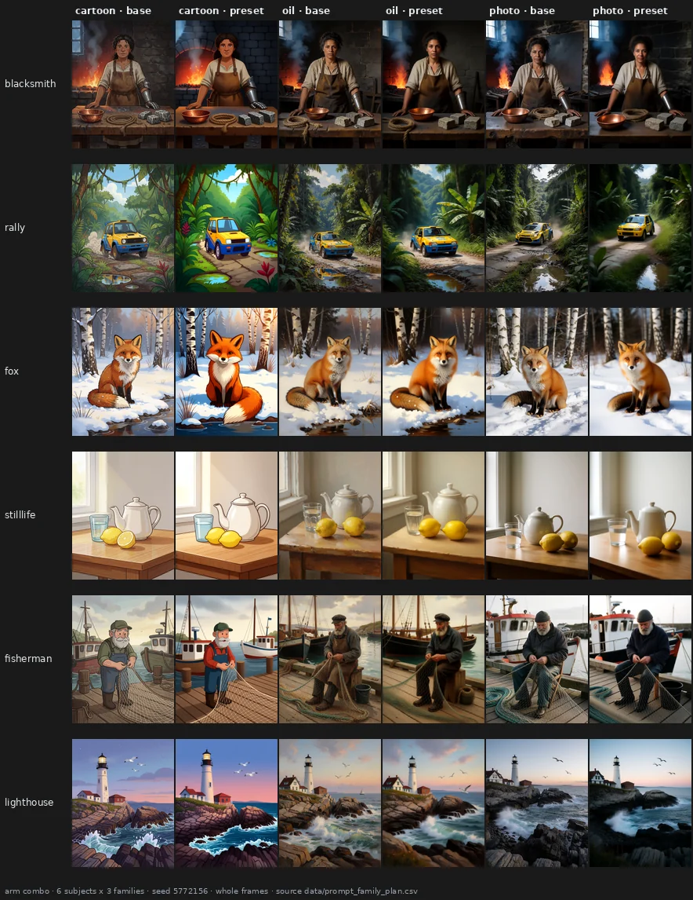
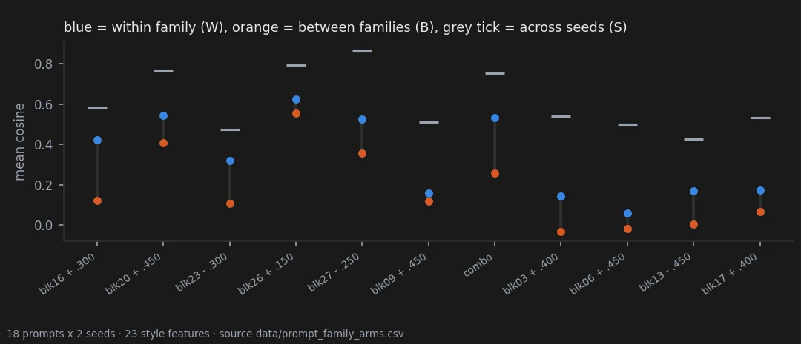
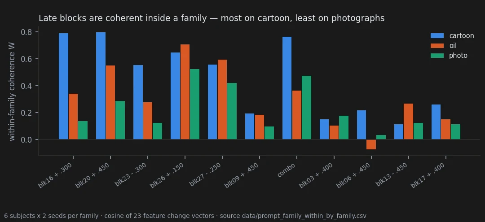
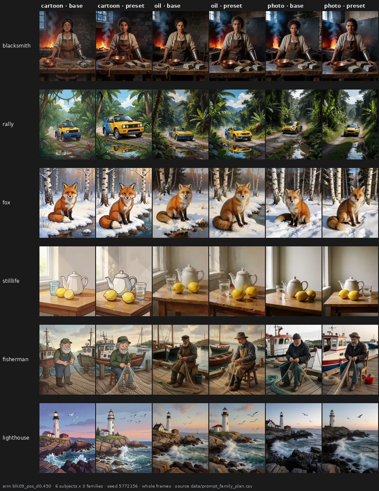
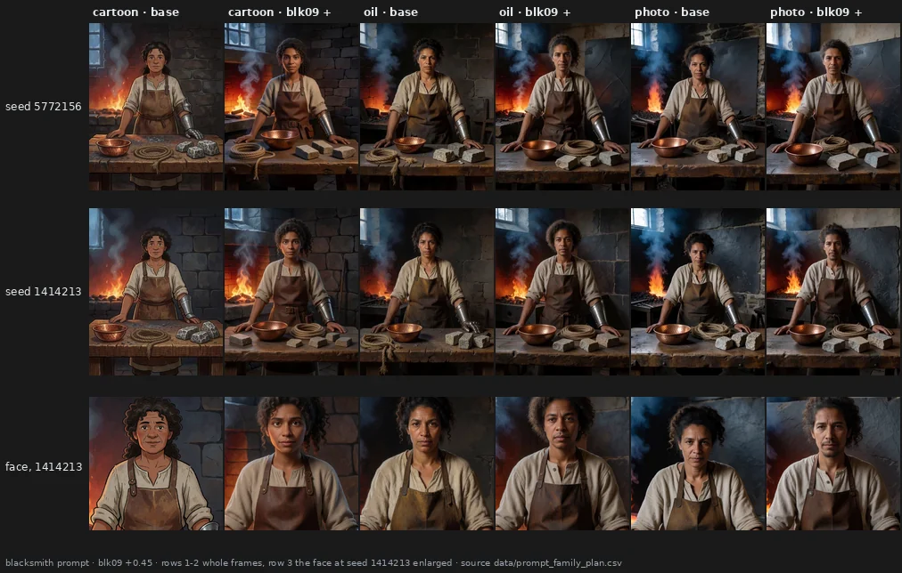

# One preset for a whole family of prompts

> **Holds** · 433 renders · 18 prompts · pre-registered 2026-10-04
> [← all results](README.md#what-holds-and-what-does-not)

> **The direction I'm chasing.** If I settle on a way of writing prompts — "Cartoon style
> illustration." followed by whatever I need — can one preset give everything I write that way
> a common look, whatever the subject? That is what a knob would be good for in practice.
>
> **What would kill it.** A preset whose change is no more alike across the subjects of one
> family than across different families, or too weak to be of use.
>
> **Where we are.** For late blocks it works: strongly on cartoon, less on oil, weakly on
> photographs. Middle blocks do something more interesting that no measure here can see, and
> they can change who is in the picture. The doses I calibrated on single images are too
> strong for a preset.

## In two minutes

Three families — "Cartoon style illustration.", "Oil painting.", "Photograph." — each followed
by the same six subjects: a blacksmith, a rally car, a fox, a still life, a fisherman, a
lighthouse. Two seeds each. Eleven edits: five late blocks at my calibrated doses, a combined
preset of four of them at lower doses, block 9 as a pre-declared control, and four middle
blocks added at my request before any render.



Read the cartoon columns first: six different subjects and one recognisable change — flatter
fills, brighter colour, cleaner outlines. In the oil and photo columns the same preset does
something milder, and different from what it does to cartoons.

## The verdict

Late-block presets are coherent inside a family: on all six tested arms the change is more alike
across the subjects of one family than across families, and inside a family it keeps about 70%
of the agreement it has across two seeds of one prompt. Coherence is strongest on cartoon and
weakest on photographs. Middle blocks give a common change that I see and no measure here
records, and block 9 can change a subject's identity. At these doses the late blocks cost
visible noise; "clean it up afterwards" was not tested.

## Why I might be wrong

* **"Coherent" means the same direction of change, measured on 23 style statistics.** Not
  identical results, and not a measure of how good the look is.
* **Three families, six subjects, two seeds.** Other styles, especially other photographic ones,
  may behave differently.
* **The by-family split was computed after the test.** The ranking cartoon > oil > photo is
  descriptive.
* **The eye pass is mine and not blind** (page 20). It was deposited before the numbers, and
  all images are published.
* **The combo is one example**, not an optimised preset.

## The data

### Coherence inside a family

For each arm, each image's change from its own baseline is a vector of 23 standardised style
features. W is the mean cosine between the changes of different subjects in the same family; B
between prompts of different families; S between the two seeds of one prompt (the ceiling).



| rule | threshold | result | verdict |
|---|---|---|---|
| H1 the family matters | W > B on ≥ 5 of 6, median W − B ≥ 0.10 | 6 of 6, **+0.19** | supported |
| H2 coherence is usable | median W ≥ 0.40 | **0.53** | supported |
| H3 blk09 + below the tested median | W < 0.53 | **0.16** | supported |
| H4 the Style band is less coherent | median W < 0.53 − 0.10 | **0.16** | supported |

The combo: W 0.53, B 0.26, S 0.75 (`data/prompt_family_test.csv`, `data/prompt_family_arms.csv`).

### Family by family



| arm | cartoon | oil | photo | eye: common look? (cartoon / oil / photo) |
|---|---|---|---|---|
| blk16 +0.30 | 0.79 | 0.34 | 0.14 | yes / yes / partly |
| blk20 +0.45 | 0.80 | 0.55 | 0.29 | yes / yes / **no** |
| blk23 −0.30 | 0.55 | 0.28 | 0.12 | yes / yes / **no** |
| blk26 +0.15 | 0.65 | 0.71 | 0.53 | yes / yes / yes |
| blk27 −0.25 | 0.56 | 0.59 | 0.42 | yes / yes / yes |
| combo | 0.76 | 0.36 | 0.48 | yes / yes / yes |

Where I saw no common look, the numbers are among the lowest. This agrees with what the
exploratory benches kept suggesting: photographic style is the hardest to steer.

### The middle blocks: the eye against the numbers

The four Style-band arms and the blk09 control sit at W 0.06–0.17, barely above B. My eye pass
said the opposite in most cells: a common, recognisable change in 8 of 12 Style-band cells and in
2 of 3 blk09 cells. What I wrote down is a change of content: blk09 + "raises realism coherently
in all", and on photographs it "idealises instead of making more realistic"; blk17 + reads as
"focus on the subject". In the sheet below (seed 5772156) the cartoon rally car becomes a
three-dimensional render.



The 23 style features measure how a picture is rendered — texture, edges, colour. H3 and H4 are
supported as statements about rendering statistics; they do not show that middle blocks lack a
family-coherent effect, only that their effect is not a rendering effect. The obvious candidate
for a content measure, DINOv2, was tried with a pre-registered threshold and failed (page 25):
"more realistic" points in a different direction for a fox and for a car in a content embedding.
The middle blocks' coherence remains an observation by eye.

### A change of identity



At seed 1414213 blk09 + turns the female blacksmith into a man in the oil and photo families;
at seed 5772156 — the seed of the sheet above — she stays a woman in all three. In the cartoon
family the same edit turns the drawing into a three-dimensional render and keeps the woman. The edit moves
the picture toward the more common reading of the words: "blacksmith" toward a man. CLIPScore on
the six blacksmith prompts falls by 3.8 under blk09 +, the largest drop of any arm
(`data/standard_metrics_summary.csv`). One subject, two seeds: this is an observation with a
number that agrees, not a test.

### The cost

By eye, blk26 +0.15 and blk27 −0.25 are not acceptable in any family — a uniform patina of noise
— and the combo is acceptable only in part in two families. BRISQUE agrees on blk27 and the combo
(+9.6) and does not see blk26 (+0.4, page 25). The doses I had calibrated on single images are
too strong for a preset applied across a family. Whether a clean-up pass can remove the cost
without removing the look is untested.

### Against an earlier overturned result

[Notebook page 09](https://github.com/aledelpho/diffusion-models-weight-steering-report/blob/4f89b6404b1df4aa2e136ff6e7b6a74a4b79be37/notebook/09-style-direction.md) tested, with criteria frozen in advance,
whether the direction a weight edit imprints depends on the declared style more than on the
subject, and it was overturned: at the usable dose 6 of 12 cells carried the opposite sign. This
page finds that, for single late blocks, the change is more alike within a style than across
styles. The two are not the same experiment — a calibrated whole-stack preset and block
derangements there, single late blocks here; eight styles sharing one scene there, three styles
crossed with six subjects here — and this page does not claim to reconcile them. A reader should
keep both.

### An open question: middle blocks for a series of assets

Middle blocks are the ones I find most valuable: they change the picture more deeply than a
retouch could, which is what a series of assets with a fixed prompt structure and style would
want. What the data say so far: a deeper change at no measured quality cost (page 25); a common
change inside a family, seen by eye only; but the least predictable blocks, able to change a
subject's identity — a risk for a series whose characters must stay the same. The test that would
decide it (C51, not run): fixed characters across poses and scenes in one style, with a
middle-block preset on and off; does the identity hold?

### Reproducing this

```yaml
model:
  checkpoint: krea2_turbo_bf16.safetensors
  weight_dtype: default
  sha256: not recorded — the file is outside the repository
sampling:
  sampler: euler_ancestral
  steps: 9
  cfg: 1.0
  denoise: 1.0
  scheduler: simple
  resolution: 1024x1280
  vae: qwen_image_vae.safetensors
  text_encoder: qwen3vl_4b_bf16.safetensors (CLIPLoader type krea2)
tuner:
  node: ArthemyKrea2ModelTuner, after ArthemyKrea2ResetPatcher
  version: not recorded — the tuner is a separate repository
  mode: Real Value, driven by a 34-slot vectors_override
prompts:
  file: data/prompt_family_plan.csv
  families: [F1cartoon, F2oil, F3photo]
  subjects: [blacksmith, rally, fox, stilllife, fisherman, lighthouse]
seeds: [5772156, 1414213]
conditions:
  - name: blk16_pos_d0.300
    measured_D: not measured; the dose is a per-block gain, not a calibrated displacement
  - name: blk20_pos_d0.450
    measured_D: not measured
  - name: blk23_neg_d0.300
    measured_D: not measured
  - name: blk26_pos_d0.150
    measured_D: not measured
  - name: blk27_neg_d0.250
    measured_D: not measured
  - name: combo
    dose: blk16 +0.20, blk20 +0.30, blk23 -0.20, blk27 -0.10
    measured_D: not measured
  - name: blk09_pos_d0.450
    measured_D: not measured
  - name: blk03_pos_d0.400
    measured_D: not measured
  - name: blk06_pos_d0.450
    measured_D: not measured
  - name: blk13_neg_d0.450
    measured_D: not measured
  - name: blk17_pos_d0.400
    measured_D: not measured
outputs:
  folder: benchmark_prompt_family
  manifest: data/prompt_family_plan.csv
analysis:
  script: experiments/analyze_prompt_family.py
  sha256: 8518e7c0a5b7014496999bfc89f285f55bb92c23a84e9dd2db73896c9419330b
  produces: data/prompt_family_style_features.csv, data/prompt_family_arms.csv, data/prompt_family_test.csv, data/prompt_family_within_by_family.csv
```

## Provenance

* **Renders.** benchmark_prompt_family (433).
* **Pre-registration:** [`docs/prereg_prompt_family.md`](https://github.com/aledelpho/diffusion-models-weight-steering-report/blob/4f89b6404b1df4aa2e136ff6e7b6a74a4b79be37/docs/prereg_prompt_family.md), with amendment 1 (four Style-band arms and
  H4), both before any render.
* **Result documents:** [`docs/prompt_family_result.md`](https://github.com/aledelpho/diffusion-models-weight-steering-report/blob/4f89b6404b1df4aa2e136ff6e7b6a74a4b79be37/docs/prompt_family_result.md), [`docs/standard_metrics_result.md`](https://github.com/aledelpho/diffusion-models-weight-steering-report/blob/4f89b6404b1df4aa2e136ff6e7b6a74a4b79be37/docs/standard_metrics_result.md).
* **Eye pass:** `data/prompt_family_eye_alessandro.csv`, deposited before the scoring ran.
* **Exploratory basis:** [`docs/style_vs_subject_exploration.md`](https://github.com/aledelpho/diffusion-models-weight-steering-report/blob/4f89b6404b1df4aa2e136ff6e7b6a74a4b79be37/docs/style_vs_subject_exploration.md).
