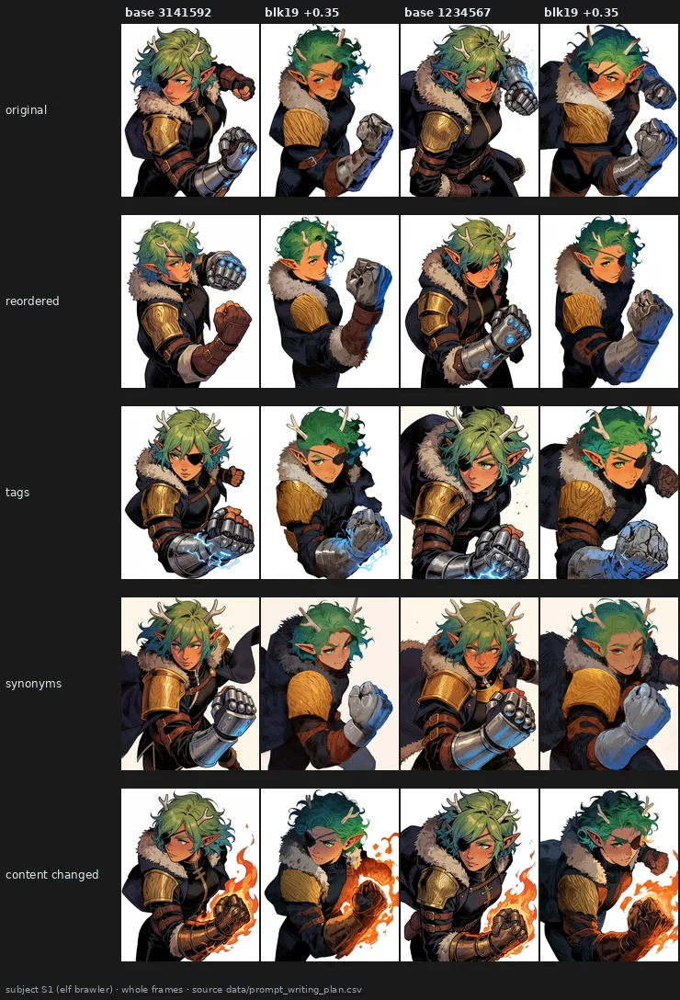
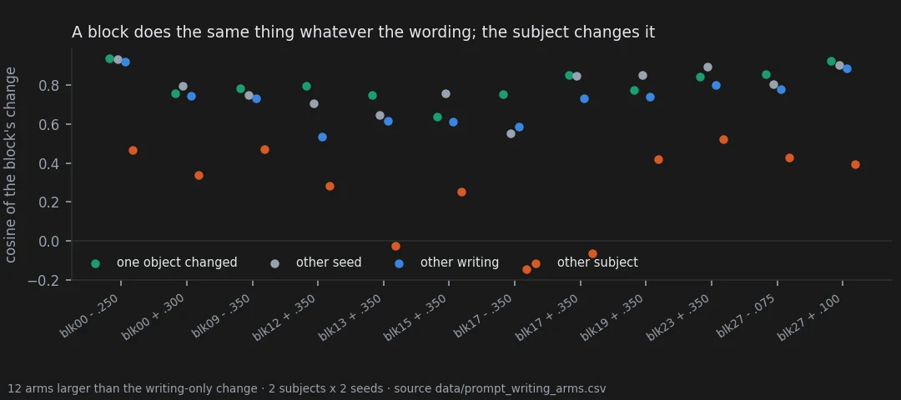

# Does the way a prompt is written change what a block does?

> **Ambiguous** · 971 renders · pre-registered 2026-10-04, inconclusive by its own rule
> [← all results](README.md#what-holds-and-what-does-not)

> **The direction I'm chasing.** A knob is useful only if it does the same thing however I happen
> to write the prompt. My claim: moving the weights gives similar results when the prompt
> describes the same content; the structure of the text matters less than the content.
>
> **What would kill it.** A block whose change depends on the wording as much as on the subject,
> or more than on the seed.
>
> **Where we are.** The first half holds by eye and by the numbers: rewriting matters about as much
> as the seed and far less than the subject. The registered verdict is still inconclusive,
> because a small change of content disturbed a block's effect even less than rewriting did — the
> opposite of what the design assumed.

## In two minutes

Two subjects — an elf brawler in a comic style, a woman asleep in a canoe on a lotus pond — each
written four ways with the same facts (original, reordered, a pure tag list, prose with
synonyms), plus one version with a single object changed (the elf's gauntlet; the sleeper turned
into an old bearded man). Twelve blocks in both directions, two seeds.



The baselines differ from row to row: each writing gives a different pose and framing. The edit
does not: under every writing and after the gauntlet change, blk19 + turns the gold pauldron into
a straw-like fur, and the antlers shrink or disappear in most frames.

## The verdict

By eye the claim holds on every arm: same change across the four writings and after the content
change. By the numbers, writing behaves like the seed and the subject dominates. The registered
verdict is inconclusive, not supported, because its third condition failed on all twelve arms:
changing one object in the prompt disturbed a block's effect less than rewriting it. Stated
plainly: the text's structure matters about as much as the seed, less than the subject, and more
than a one-object change of content.

## Why I might be wrong

* **Two subjects, one seed pair.** On the canoe the arms are about half as strong as on the elf,
  and only 12 of 24 arms are larger than what rewriting alone does to the baseline.
* **The style features are partly sensitive to layout.** How close two edits look depends partly
  on how close the two pictures were to start with; the one-object change kept the layout best,
  which favours it. This does not explain the subject result.
* **The canoe content change kept two words of the original.** The "old bearded man" prompt
  still reads "one arm bends above her head … across her torso", a leftover of the edit.
* **The eye pass is mine and not blind** (page 20).

## The data

### How it was measured

Each image is reduced to 23 style features; an arm's effect on a prompt is its vector of feature
changes from the same prompt's baseline. A is the mean cosine between two such vectors:
A_writing across writings of the same subject, A_seed across seeds, A_content_small between the
original and the one-object change, A_subject between the two subjects. Only arms whose change is
larger than what rewriting does to the baseline (size > 1.15) are scored.



### The registered rule

| condition | needed | result | |
|---|---|---|---|
| median (A_writing − A_seed) | ≥ −0.10 | **−0.04** | met |
| A_writing > A_subject | ≥ 75% of arms | **12 of 12** | met |
| A_writing > A_content_small | ≥ 60% of arms | **0 of 12** | not met |

Scored arms: blk00 ±, blk09 −, blk12 +, blk13 +, blk15 +, blk17 ±, blk19 +, blk23 +, blk27 ±. On
them A_writing runs 0.53–0.92 and A_subject −0.15 to 0.52: what the picture contains decides what
a block does to it. A tag list against the original behaves like the other rewrites. The third
condition failed because the one-object change kept the picture (layout r of its baseline with
the original 0.68–0.76) while rewriting moved pose and framing (0.48–0.76). The design assumed the
opposite ordering. The same ordering appears in DINOv2 space (page 25): A_content_small 0.29 >
A_seed 0.22 > A_writing 0.16 ≫ A_subject 0.02.

### Word order

Before C45, an exploratory bench rendered one prompt in five word orders, two seeds, 56 arms.
By eye, blk19 + shrinks or removes the antlers and turns the pauldron to fur in 10 of 10 renders,
blk26 + lays the same mosaic of colour cells over the frame in 10 of 10, and blk17 + slims the
collar and simplifies the figure in 5 of 5 orders at one seed. With the same features:
consistency across orders tracks consistency across seeds (r = 0.92 over 56 arms) and is on
average 0.06 higher. Every arm with low consistency is among those whose change is smaller than
the reordering itself. The order does change the picture — baselines differ by ΔE 16–31, as much
as most edits — but it changes the frame, not the character, and not what a block does to it.

### Reproducing this

```yaml
model:
  checkpoint: krea2_turbo_bf16.safetensors
  weight_dtype: default
  sha256: not recorded — the file is outside the repository
sampling:
  sampler: euler_ancestral
  steps: 9
  cfg: 1.0
  denoise: 1.0
  scheduler: simple
  resolution: 1024x1280
  vae: qwen_image_vae.safetensors
  text_encoder: qwen3vl_4b_bf16.safetensors (CLIPLoader type krea2)
tuner:
  node: ArthemyKrea2ModelTuner, after ArthemyKrea2ResetPatcher
  version: not recorded — the tuner is a separate repository
  mode: Real Value, driven by a 34-slot vectors_override
prompts:
  file: data/prompt_writing_plan.csv
  ids: [S1_W3_tags, S1_W4_synonyms, S1_C1_flamegauntlet, S2_W1_original, S2_W2_reordered, S2_W3_tags, S2_W4_synonyms, S2_C1_oldman]
  reused: S1_W1 and S1_W2 are V1_Original and V5_Inverse of benchmark_prompt_order
seeds: [3141592, 1234567]
conditions:
  - name: blocks 00, 02, 05, 08, 09, 12, 13, 15, 17, 19, 23 at -0.35 and +0.35 (blk00 -0.25 / +0.30)
    measured_D: not measured; the dose is a per-block gain, not a calibrated displacement
  - name: blk27_neg_d0.075, blk27_pos_d0.100
    measured_D: not measured
outputs:
  folders: [benchmark_prompt_writing, benchmark_prompt_order]
  manifest: data/prompt_writing_plan.csv
analysis:
  scripts:
    - experiments/analyze_prompt_writing.py             # 4f7034db6a713f82c7135b64062586b4277db29afb4f53c6ee6eeb697dccc468
    - experiments/prompt_order_feature_consistency.py   # 3a62edb33adf9d6afd161e24a6e04eeeaa2cc667b40ba3ce6a4ed5803ec0f23e
  produces: data/prompt_writing_arms.csv, data/prompt_writing_test.csv, data/prompt_order_feature_consistency.csv
```

## Provenance

* **Renders.** benchmark_prompt_writing (401), benchmark_prompt_order (570).
* **Pre-registration:** [`docs/prereg_prompt_writing.md`](https://github.com/aledelpho/diffusion-models-weight-steering-report/blob/e20fcae6b9a191b25747aa15b68ab73a4c4052c6/docs/prereg_prompt_writing.md), with amendment 1; scoring code
  committed before any render.
* **Result documents:** [`docs/prompt_writing_result.md`](https://github.com/aledelpho/diffusion-models-weight-steering-report/blob/e20fcae6b9a191b25747aa15b68ab73a4c4052c6/docs/prompt_writing_result.md), [`docs/block_groups_and_prompt_order.md`](https://github.com/aledelpho/diffusion-models-weight-steering-report/blob/e20fcae6b9a191b25747aa15b68ab73a4c4052c6/docs/block_groups_and_prompt_order.md)
  §3 (word order, exploratory).
* **Eye pass:** `data/prompt_writing_eye_alessandro.csv`, deposited before the test ran.
* **Data:** `data/prompt_writing_style_features.csv`, `data/prompt_writing_arms.csv`,
  `data/prompt_writing_test.csv`, `data/prompt_order_feature_consistency.csv`,
  `data/prompt_order_baselines.csv`.
