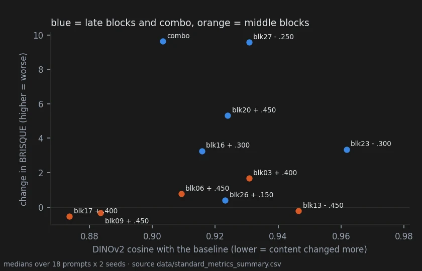

# What the standard metrics see, and what they miss

> **Overturned** · 962 renders · the one prediction refuted, the measurements kept
> [← all results](README.md#what-holds-and-what-does-not)

> **The direction I'm chasing.** The results on the other pages rest on my eye and on statistics
> written for this project. A reader will ask what the usual metrics say: image quality, prompt
> adherence, perceptual distance, content similarity. I wanted them on the same images, decided
> before they were computed.
>
> **What would kill it.** Standard metrics that contradict the published verdicts — or that see,
> without my eye, what only my eye had seen.
>
> **Where we are.** They confirm the saturation knob against the words and put a price on each
> preset. They do not see what the middle blocks do across a family: the one prediction I made
> about them failed.

## In two minutes

No new renders: BRISQUE and CLIP-IQA (quality without a reference), CLIPScore (adherence to the
prompt), LPIPS, DISTS and SSIM (distance from the baseline), and DINOv2 cosine (same content as
the baseline) were computed on every image of the three confirmatory benches — wording,
saturation, prompt family — under a plan written before any of them was run.



Read the figure as two corners. Bottom right: the middle blocks, which move the content most and
leave BRISQUE where it was. Top left: the late blocks and the combined preset, which keep the
content and raise BRISQUE.

## The verdict

On the saturation knob the standard metrics agree with the published verdict: at the same colour
gain, block 23 stays closer to the original than the words "colorful" (LPIPS 7 of 7, DINOv2 6 of
7). On the prompt-family presets they put a price on each arm: the late blocks and the combo cost
up to +9.6 BRISQUE, the middle blocks nothing measurable, while changing the content most. The
pre-registered prediction that DINOv2 would see the middle blocks' family-coherent change is
refuted: it is an observation by eye that no metric here reproduces.

## Why I might be wrong

* **No-reference quality metrics miss what the eye calls noise.** blk26 +0.15 was judged not
  acceptable in every family by eye and costs +0.4 BRISQUE. A low BRISQUE is not evidence of a
  clean picture.
* **"No measured cost" is not "no cost".** It means these two metrics did not move.
* **The depth-against-cost reading is descriptive.** It was pre-specified as a measurement, with
  no rule that could fail.
* **CLIPScore on the saturation bench is not comparable across conditions.** It was computed
  against each image's own prompt, which for the word conditions includes the added words — a
  defect of the plan, recorded and not interpreted.
* **DINOv2 is one content embedding.** Another may see what this one does not.

## The data

### The saturation knob, again

| measure | blk23 closer to the original than "colorful" at the same chroma gain | median difference |
|---|---|---|
| LPIPS | **7 of 7** scorable cells | −0.10 |
| DINOv2 cosine | **6 of 7** | +0.019 |
| layout r (page 22, pre-registered) | 6 of 7 | +0.08 |

Quality: BRISQUE moves by −0.95 for "colorful", +0.87 for blk23 −0.45 and −3.7 for blk23 +0.30;
CLIP-IQA by at most 0.02 anywhere. The full comparison is on [page 22](22-saturation-knob.md).

### Depth against cost

| arm | ΔBRISQUE (higher = worse) | LPIPS to base | DINOv2 cosine to base | ΔCLIPScore, blacksmith |
|---|---|---|---|---|
| blk23 −0.30 | +3.4 | 0.27 | **0.96** | −0.9 |
| blk26 +0.15 | +0.4 | 0.38 | 0.92 | −0.2 |
| blk16 +0.30 | +3.3 | 0.45 | 0.92 | −1.2 |
| blk20 +0.45 | +5.3 | 0.46 | 0.92 | −1.9 |
| blk27 −0.25 | **+9.6** | 0.46 | 0.93 | −2.2 |
| combo | **+9.6** | 0.49 | 0.90 | −3.0 |
| blk13 −0.45 | −0.2 | 0.43 | 0.95 | −0.2 |
| blk03 +0.40 | +1.7 | 0.45 | 0.93 | −1.1 |
| blk06 +0.45 | +0.8 | 0.49 | 0.91 | −1.0 |
| blk17 +0.40 | −0.5 | 0.50 | **0.87** | −2.4 |
| blk09 +0.45 | −0.3 | **0.53** | **0.88** | **−3.8** |

Medians over 36 images per arm (`data/standard_metrics_summary.csv`). Not every middle block goes
deep: blk13 − stays at 0.95, close to the late blocks. The two that do, blk09 + and blk17 +, are
also the two that lower adherence most on the blacksmith prompts — where blk09 + turned the woman
into a man at one of the two seeds ([page 23](23-prompt-family-presets.md#a-change-of-identity)).

### A content embedding does not see it

H5 asked whether the middle blocks' common change, seen by eye inside each family, would show up
as coherence of DINOv2-embedding changes. Median within-family coherence of the five middle arms:
**0.007** against 0.159 on the style features and a threshold of 0.259. Refuted. In DINOv2 space
no arm is family-coherent, late blocks included (all W ≤ 0.06): the same change, "more realistic",
points one way for a fox and another way for a car in an embedding built around content.

### Wording, in DINOv2 space

A_content_small 0.29 > A_seed 0.22 > A_writing 0.16 ≫ A_subject 0.02: the same ordering as the
style features on [page 24](24-wording.md). The subject dominates; rewriting behaves like the seed.

### Reproducing this

```yaml
model:
  checkpoint: krea2_turbo_bf16.safetensors
  weight_dtype: default
  sha256: not recorded — the file is outside the repository
sampling:
  sampler: euler_ancestral
  steps: 9
  cfg: 1.0
  denoise: 1.0
  scheduler: simple
  resolution: 1024x1280
  vae: qwen_image_vae.safetensors
  text_encoder: qwen3vl_4b_bf16.safetensors (CLIPLoader type krea2)
tuner:
  node: ArthemyKrea2ModelTuner, after ArthemyKrea2ResetPatcher
  version: not recorded — the tuner is a separate repository
  mode: Real Value, driven by a 34-slot vectors_override
prompts:
  files: [data/prompt_writing_plan.csv, data/blk23_colorful_plan.csv, data/prompt_family_plan.csv]
seeds: [2718281, 3141592, 1618033, 4669201, 5772156, 1414213, 1234567]
conditions:
  - name: every condition of the three benches, as listed on pages 22, 23 and 24
    measured_D: not measured; the doses are per-block gains, not calibrated displacements
outputs:
  folders: [benchmark_prompt_writing, benchmark_blk23_colorful, benchmark_prompt_family]
  manifest: data/standard_metrics_c45.csv, data/standard_metrics_c47.csv, data/standard_metrics_c49.csv
analysis:
  scripts:
    - experiments/standard_metrics.py           # 744fc3854a7b6a6be4b3ca95cacd54f2337d3ba3521119eb82d0936a3195c245 (GPU, piq + open_clip + DINOv2 ViT-B/14)
    - experiments/analyze_standard_metrics.py   # eb36aa06bca4a9db9a4537cb3a30e34a29975ed4b9c3af13d587322bfa83d08c
  produces: data/standard_metrics_summary.csv
```

## Provenance

* **Renders.** benchmark_prompt_writing (401), benchmark_blk23_colorful (128), benchmark_prompt_family (433).
* **Pre-registration:** [`docs/prereg_standard_metrics.md`](https://github.com/aledelpho/diffusion-models-weight-steering-report/blob/97134a26a0700d864903e87cc3d81386318c244f/docs/prereg_standard_metrics.md), written before any of the metrics was
  computed on these images; H5's wording was fixed in it before the run.
* **Result document:** [`docs/standard_metrics_result.md`](https://github.com/aledelpho/diffusion-models-weight-steering-report/blob/97134a26a0700d864903e87cc3d81386318c244f/docs/standard_metrics_result.md).
* **Data:** `data/standard_metrics_c45.csv`, `data/standard_metrics_c47.csv`,
  `data/standard_metrics_c49.csv`, `data/standard_metrics_summary.csv`.
* **Run notes:** [`docs/RENDERS_2026-10-05_standard_metrics.md`](https://github.com/aledelpho/diffusion-models-weight-steering-report/blob/97134a26a0700d864903e87cc3d81386318c244f/docs/RENDERS_2026-10-05_standard_metrics.md).
