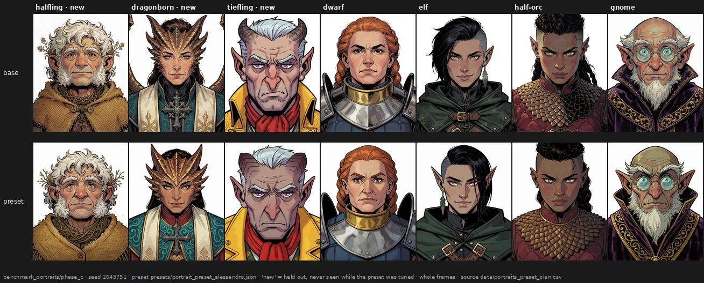

# A preset made by eye, tested blind on characters it never saw

> **Holds** · 514 renders · 7 prompts · pre-registered 2026-10-05
> [← all results](README.md#what-holds-and-what-does-not)

> **The direction I'm chasing.** The block map is only useful if someone can use it: look at what
> each block does, mix a few of them into a preset of their own, and get the look they had in
> mind — on new pictures, not only on the ones they tuned it on. And the character has to stay
> the same character.
>
> **What would kill it.** A preset that only works on the pictures it was tuned on; a look that
> someone who does not know which image carries it cannot pick out; a face that changes into
> someone else.
>
> **Where we are.** The look carries over to characters the preset never saw, and a blind
> observer picked it 56 times out of 56. The character stays recognisable, but the face moves a
> little more than a change of seed moves it, and an expression can go flat. The test had one
> observer and no sheets with two different characters.

## In two minutes

> **Try it yourself.** The same blind choice, 14 pairs, takes two minutes: [take the test](https://aledelpho.github.io/krea2-weight-knobs-results/try-the-test.html). Take it
> before looking at the pictures below if you can.

Seven character portraits written in one template ("Western comics style, close-up portrait,
frontal view.", then the character). On four of them I looked at every single block pushed both
ways (457 renders) and wrote a preset by eye: ten blocks, doses between 0.05 and 0.35. What I
wanted, in my words before any test: *a more American-comic look leaning toward animation: flat
colours and clean lines, with proportions exaggerated only slightly compared with the default.*
The preset was frozen, the rules and scoring code committed, and only then were all seven
characters rendered at four new seeds, with and without it.



The three columns marked *new* are the test: the halfling, the dragonborn and the tiefling were
written into the plan but never rendered while I was tuning. Then someone who had never seen the
project looked at the pairs without knowing which side carried the preset.


## The verdict

A preset written by eye from the single-block map transfers: its change is as coherent on three
unseen characters as on the four it was tuned on (0.51 against 0.61), and a blind observer chose
it as the closer match to the described look in 56 of 56 comparisons. The characters stay
themselves — far closer to their own base than to any other character — but the rule I set for
the face, "no more change than a new seed", was not met. Looking at the worst cases, the
preset can also turn a prompted expression flat and remove small prompted details.

## Why I might be wrong

* **One blind observer, and close to me.** My partner, who had not seen the project and did not
  know which image carried the preset or what result was expected; I was out of the room. Her
  answers are strong evidence that the change is visible and goes the described way, not a
  measure of how many people would agree.
* **The question named the look.** She was asked which image matched "more American comic /
  animation", not to describe what changed. A preset that only did something else would have
  failed; a preset that did this plus something unwanted could still pass.
* **"Same character" had no foil.** Every sheet showed one character twice, so answering yes
  every time could not be wrong. The evidence on identity is ArcFace, not the observer.
* **The model observers did not work.** The pre-registered first blind protocol used three model
  instances; the first read position, not pictures (LEFT on 51 of 56 sheets), and the other two
  were not run. That arm is reported as not completed.
* **My own eye pass is not blind** (page 20). It said yes to every question, which is why the
  blind test was added.
* **Seven characters in one drawn style, one preset, four seeds.** Nothing here says how a
  preset for photographs would fare.

## The data

### The look carries over

Coherence is the agreement between the changes the preset makes on two pictures, measured on 23
style statistics (page 20): 1 means the same change, 0 unrelated. The rules, written before the
test renders:

| rule | threshold | result | verdict |
|---|---|---|---|
| G_S the preset agrees with itself across seeds | median ≥ 0.50 | **0.78** | pass |
| H1 coherent across the three new characters | median ≥ 0.40 | **0.51** | **supported** |
| H2 no worse than on the four calibration characters | ≥ 0.61 − 0.15 | **0.51** | **supported** |

Data: `data/portrait_preset_tests.csv`, `data/portrait_preset_measures.csv`,
`data/portrait_preset_style_features.csv`. The reproduction check opened the batch: a phase A base,
rendered again, is the same file pixel for pixel (largest difference 0); all 57 planned renders
are present.

### A blind observer

Each sheet showed the base and the preset of one character at one seed, side by side, under a
random number; every pair appeared twice, once with the sides swapped, in a shuffled order of 56.
The key was committed before anyone answered.


| | original set | mirrored set | verdict |
|---|---|---|---|
| position check: same side named on both versions of a pair | 0 of 28 | | pass |
| **H4** preset chosen, held-out characters | **12/12** (p = 0.0002) | **12/12** | **supported** |
| H5 "same character", held-out characters | 12/12 | 12/12 | passes, without foils |
| calibration characters, preset chosen (reported) | 16/16 | 16/16 | |

Answers: `data/portrait_preset_blind_answers_human.csv`; key: `data/portrait_preset_blind_key.csv`;
tally: `data/portrait_preset_blind_tests_human.csv`. The model observer's answers and diagnostic
tally are in `data/portrait_preset_blind_answers_model_obs1.csv` and
`data/portrait_preset_blind_tests_model_obs1_diagnostic.csv`.

### The face

ArcFace, a face-recognition network, gives one vector per detected face; two faces of the same
person score high. It found no face in three of the four gnome preset images and in two tiefling
images, one of them a base, so the identity rule was scored on the halfling and the dragonborn:

| character | base vs preset, same seed | base vs base, another seed | rule: first above second |
|---|---|---|---|
| halfling (new) | 0.75 | 0.82 | no |
| dragonborn (new) | 0.74 | 0.75 | no |

H3 is refuted. The calibration characters show the same pattern. Described after the test, over
every detected face: the same character at another seed 0.80 (39 pairs), base against preset 0.74
(23), two different characters 0.29 (312, highest 0.68). The preset keeps each face far closer to
itself than to anyone else, and a little further than a seed change does — and these prompts are
so specific that a seed change barely moves the face. Data: `data/portrait_preset_faces.csv`.

### What the preset takes away

After every number was in, I opened at 1:1 the seven pairs ArcFace marked worst — the gnome at
three seeds, the tiefling at two, the half-orc and the dwarf at one. Not blind, and selected.

* **No deformation** in any of the seven; the lost detections on the gnome are not damage.
  Glasses, ears, beard and robe on the gnome, horns, scarf and yellow jacket on the tiefling: each
  pair is the same character.
* **Small prompted details go with the hatching**: the half-orc's dirt smudges across the nose,
  the gnome's glowing chalk dust, the tiefling's embroidered coat. "Clean lines" also means fewer
  small marks, including requested ones.
* **Prompted shapes can drift.** The tiefling is prompted with "short curling horns swept flat
  against cropped silver hair" and a "yellow fancy jacket"; at all four seeds the preset makes the
  horns larger and heavier and the jacket plain:


* **Expressions can go flat.** The gnome is prompted "wide-eyed manic curiosity": wide-eyed and
  mild in all three bases, frowning in all three presets. The half-orc's "fierce defiant snarl"
  becomes a closed, stern face — the largest drift of the seven, and its lowest ArcFace score.

The preset contains block 8 at +0.15, which my own guide on page 21 lists as giving less
expression; it is the first suspect, and scaling it alone on these portraits would test it.
Details: [`docs/portrait_preset_result.md`](https://github.com/aledelpho/diffusion-models-weight-steering-report/blob/c20687a6c36243542f45f2afc4798c27f2c1c276/docs/portrait_preset_result.md).

### Reproducing this

```yaml
model:
  checkpoint: krea2_turbo_bf16.safetensors
  weight_dtype: default
  sha256: not recorded — the file is outside the repository
sampling:
  sampler: euler_ancestral
  steps: 9
  cfg: 1.0
  denoise: 1.0
  scheduler: simple
  resolution: 1024x1280
  vae: qwen_image_vae.safetensors
  text_encoder: qwen3vl_4b_bf16.safetensors (CLIPLoader type krea2)
tuner:
  node: ArthemyKrea2ModelTuner, after ArthemyKrea2ResetPatcher
  version: not recorded — the tuner is a separate repository
  mode: Real Value, driven by a 34-slot vectors_override
prompts:
  file: data/portraits_preset_plan.csv
  calibration: [D1_dwarf_paladin, E2_elf_rogue, O4_halforc_fighter, G5_gnome_wizard]
  held_out: [H3_halfling_druid, R6_dragonborn_cleric, T7_tiefling_bard]
seeds:
  phase_a: [2236067, 1732050]
  phase_c: [2645751, 3316624, 3605551, 4123105]
conditions:
  - name: baseline
    measured_D: not measured
  - name: preset
    file: presets/portrait_preset_alessandro.json
    dose: blk01 +0.10, blk08 +0.15, blk09 -0.35, blk11 +0.05, blk14 +0.10, blk18 +0.10, blk19 -0.10, blk20 +0.10, blk24 -0.10, blk25 -0.12
    measured_D: not measured; the preset is a vector of per-block gains, not a calibrated displacement
outputs:
  folder: benchmark_portraits/phase_c (test), benchmark_portraits/renders (phase A atlas)
  manifest: data/portraits_preset_plan.csv
analysis:
  script: experiments/analyze_portrait_preset.py
  sha256: 971e7e8443308b5abdff8ffb69ff0309ecb7175da3db14cb00dcea3873406221
  produces: data/portrait_preset_style_features.csv, data/portrait_preset_faces.csv, data/portrait_preset_measures.csv, data/portrait_preset_tests.csv
  blind_test: experiments/portrait_preset_blind.py (sha256 28387514a91f195f9e62f8303a9a89e6193f582a63dc63a7f0a355145ad6b56e)
```

## Provenance

* **Renders.** benchmark_portraits/renders (457), benchmark_portraits/phase_c (57).
* **Pre-registration:** [`docs/prereg_portrait_preset.md`](https://github.com/aledelpho/diffusion-models-weight-steering-report/blob/c20687a6c36243542f45f2afc4798c27f2c1c276/docs/prereg_portrait_preset.md), with amendment 1 (model observers) and
  amendment 2 (human observer), each committed before its observers answered; the preset was
  frozen in [`presets/portrait_preset_alessandro.json`](https://github.com/aledelpho/diffusion-models-weight-steering-report/blob/c20687a6c36243542f45f2afc4798c27f2c1c276/presets/portrait_preset_alessandro.json) before any test render.
* **Result document:** [`docs/portrait_preset_result.md`](https://github.com/aledelpho/diffusion-models-weight-steering-report/blob/c20687a6c36243542f45f2afc4798c27f2c1c276/docs/portrait_preset_result.md).
* **Render logs:** [`docs/RENDERS_2026-10-05_portraits.md`](https://github.com/aledelpho/diffusion-models-weight-steering-report/blob/c20687a6c36243542f45f2afc4798c27f2c1c276/docs/RENDERS_2026-10-05_portraits.md), [`docs/RENDERS_2026-10-05_portraits_phase_c.md`](https://github.com/aledelpho/diffusion-models-weight-steering-report/blob/c20687a6c36243542f45f2afc4798c27f2c1c276/docs/RENDERS_2026-10-05_portraits_phase_c.md).
* **Eye pass:** `data/portrait_preset_eye_alessandro.csv`, deposited before any number.
* **Phase A plan:** 457 rows written by [`experiments/portraits.py`](https://github.com/aledelpho/diffusion-models-weight-steering-report/blob/c20687a6c36243542f45f2afc4798c27f2c1c276/experiments/portraits.py) (`--plan`), committed beside the
  other bench plans.
* **Public version of the blind test:** [`experiments/build_try_the_test.py`](https://github.com/aledelpho/diffusion-models-weight-steering-report/blob/c20687a6c36243542f45f2afc4798c27f2c1c276/experiments/build_try_the_test.py) builds the page from 14
  pairs at seeds 3605551 and 4123105. Answers shared through it are kept apart from this result.
