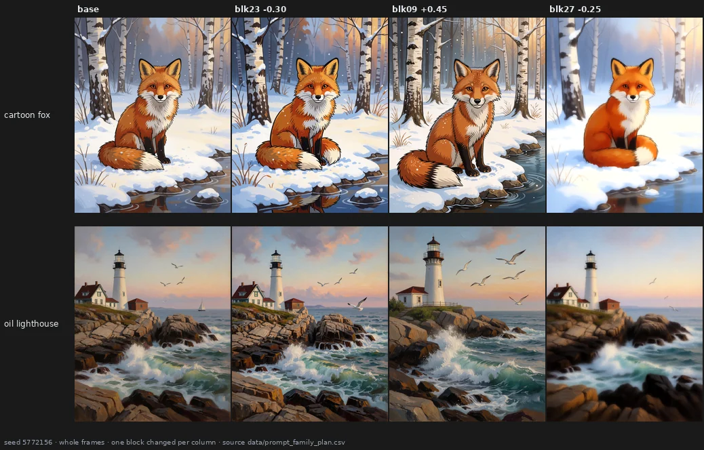
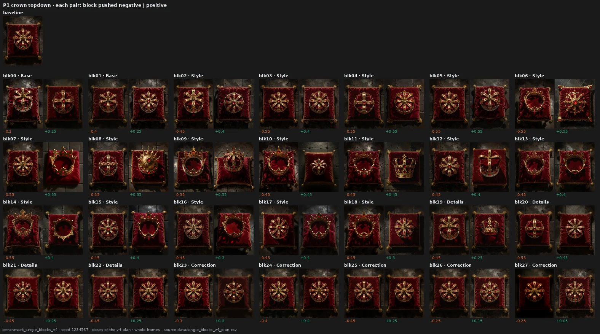
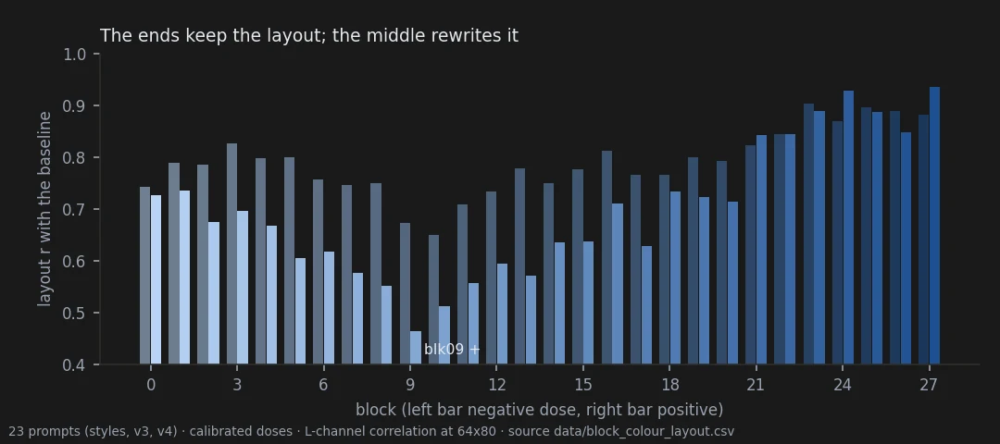
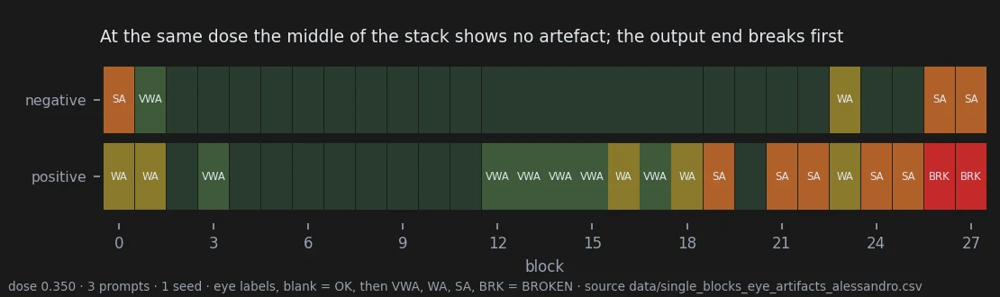
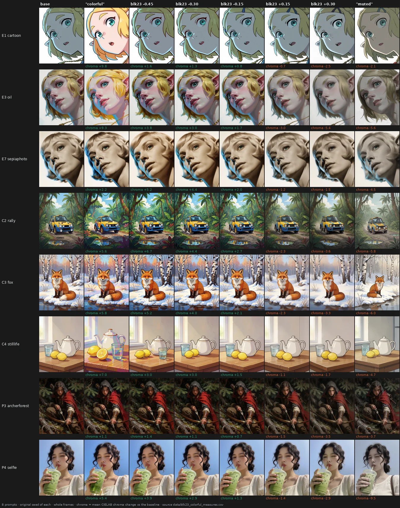
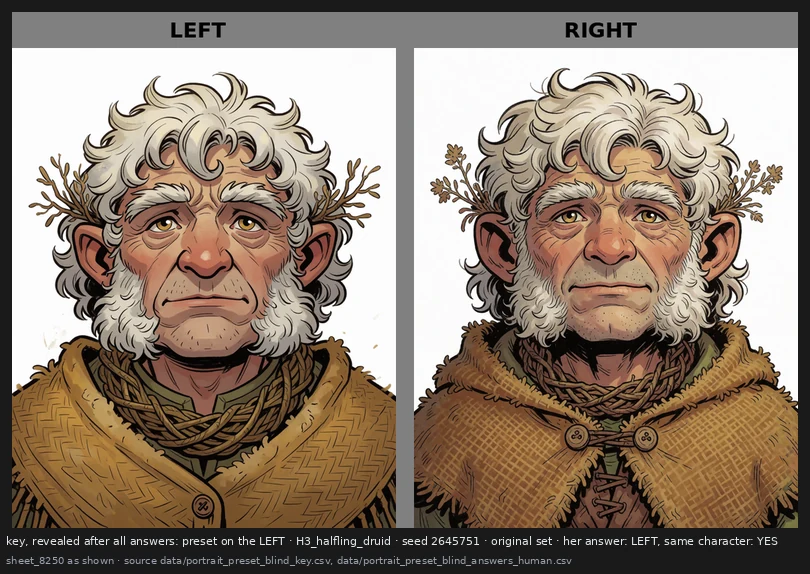
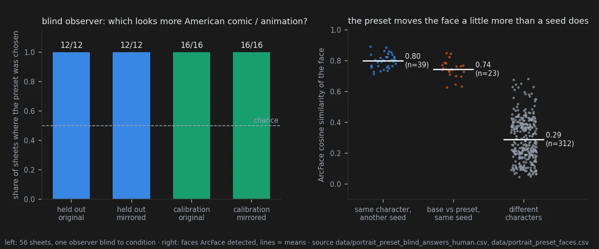
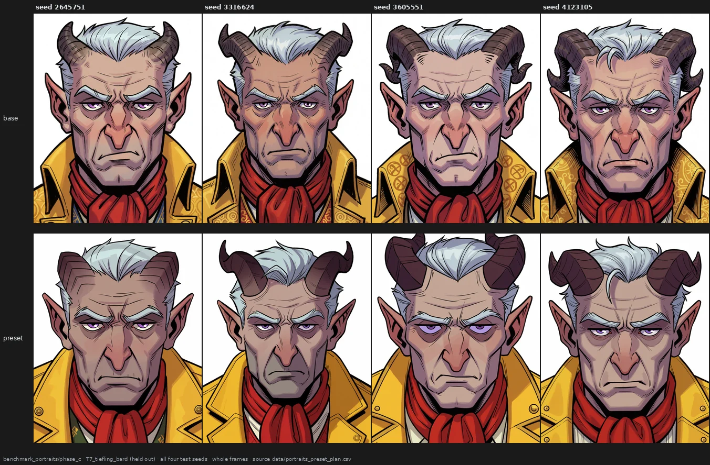
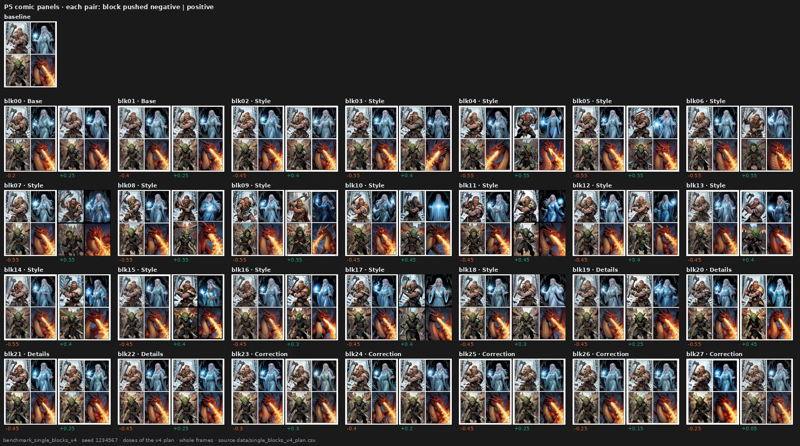

# The story: knobs inside a diffusion model

*Read this first. This page tells, with pictures, what we found out about one image model, Krea-2,
by changing its weights one block at a time with a small tool, the Krea-2 tuner. It holds no new
measurement: every number is copied from the result page linked at the end of each section, where
the method, the data and the reservations are. Each section ends with the status of what it
says — **holds** (passed a test fixed before the data), **ambiguous**, **open** (seen, not yet
tested) or **overturned** (tested and failed).*

---

## 1 · What does the tool do?

An image model like Krea-2 is a stack of 28 blocks. A text prompt goes in at one end, and through
nine passes the stack turns noise into a picture. Each block is a set of weight matrices learned
during training. The Krea-2 tuner does one simple thing: it multiplies the weights of a block by a
number a little above or below one, without any training. A "preset" is just the list of those
numbers.

Three blocks, three different changes: more colour, a more realistic and different scene, a softer
picture. The question of this whole work is whether such a change is a **knob** — something that
does the same thing on any picture, and that you can turn up and down — or just a way of shaking
the model.

Before any of that, the instrument had to be trusted. With every value at zero the tuner changes no
pixel, and the same render made again days later is identical to the bit, checked again before
every test in this report. The one instrument that cannot be made exact is my eye: I judge the
pictures knowing which edit made them, so every image is published for anyone to look again.

→ [page 20](20-method.md) · **holds**

---

## 2 · What is inside the model?

Push every block in turn and look. The stack is not 28 copies of the same thing.

The blocks near the end (21–27) change **properties of the image** — colour, grain, sharpness,
softness — and the crown stays the same crown. The blocks in the middle change **what is depicted**:
the crown becomes an open ring, is seen from the side, becomes another crown. The first two blocks
behave like the last ones, on grain and detail.

Measured, the same split appears three ways. The end blocks keep the composition of the picture;
the middle rewrites it. At equal strength, only the blocks at the two ends are recognisable as
themselves on a different picture; a middle block does something reproducible on one picture and
something else on another. And by a content measure (DINOv2), middle blocks change the content the
most. One caution: the end blocks do not change *fewer* rendering statistics — grain moves many of
them at once — they change fewer *kinds* of property.

Neighbouring blocks also work in groups: 08–10, 15–16 and 23–26 pushed up move the picture the same
way, on two sets of prompts. And the split is faintly visible in the weights themselves: the two
blocks that rewrite the picture most, 8 and 9, have the strongest single direction in their MLP —
a result that passed its test by a thin margin.

→ [page 21](21-block-map.md) · map **open**, weights **ambiguous**

---

## 3 · How far can you push?

Not every block can be pushed the same amount.

At the same strength, the output end breaks first: pushed up, blocks 26 and 27 destroy the picture,
and most of 19–25 add visible artefacts. The middle shows nothing at that strength. That is a **hard
limit** — grain, noise, a mosaic of colour, things anyone recognises as broken.

The middle has another limit, a **soft** one: the picture stays clean and well rendered, but the
drawing stops making sense — faces flattened into masks, anatomy undone, objects fused. Nothing in
it looks like an error, so it is the harder one to see, and no statistic in this project detects it.
Section 8 shows one.

→ [page 21](21-block-map.md#how-far-each-block-can-be-pushed) · **open**, the soft limit is an observation

---

## 4 · Is there a knob that does one thing everywhere?

One block came closest: block 23. Turned one way it adds colour, turned the other way it removes it.

Tested on eight new prompts, two seeds each: colour moves the expected way, step by step along the
dose, in 15 of 16 cases, and doubling the dose roughly doubles the effect (×1.76). The obvious
alternative is to write "colorful, vivid highly saturated colors" in the prompt. The words do more,
and that is their problem:

The words redraw the cartoon elf and add a lemon to the still life. Where the block and the words
add the same amount of colour, the block leaves the rest of the picture closer to the original on
every measure tried. But it is a gentle knob: on 9 of 16 cases the words reach more colour than the
block at its strongest tested setting.

→ [page 22](22-saturation-knob.md) · **holds**

---

## 5 · Can one preset give a whole style its look?

If I always write "Cartoon style illustration." before my subject, can one preset give everything I
write that way a common look? Six subjects, three styles, two seeds.

For presets made of end blocks, yes: the change is clearly more alike inside a style than across
styles, and inside a style it keeps about 70% of the agreement it has between two seeds of the same
prompt. It works best on cartoons and least on photographs.

Middle blocks are the interesting case. By eye they also give a style a common change — block 9
makes everything more realistic — but it is a change of content, and none of our measures sees it.
And content can mean identity:

At one seed the female blacksmith stays a woman; at the other, in two styles, she becomes a man —
the more common picture of the word "blacksmith". For a series of images whose characters must stay
the same, that is the risk to test next.

→ [page 23](23-prompt-family-presets.md) · end blocks **holds** · middle blocks **open**

---

## 6 · Can I make my own preset, and does it work on new pictures?

The map is only worth something if someone can use it. So I tried, on character portraits: I
looked at what every block does to four drawn characters, then wrote a preset of ten small numbers
aiming at *a more American-comic look leaning toward animation: flat colours and clean lines*. I
froze it, and only then rendered seven characters at four new seeds, with and without it. The
halfling, the dragonborn and the tiefling had never been rendered while I tuned.

> **Try it yourself.** The same blind choice, 14 pairs, takes two minutes: [take the test](https://aledelpho.github.io/krea2-weight-knobs-results/try-the-test.html). Take it
> before looking at the pictures below if you can.

By the numbers, the preset changes the three new characters in a common direction about as
coherently as the four it was tuned on (0.51 against 0.61). But I made it, and I knew which image
was which, so the real test was someone else's eye. My partner, who had never seen the project,
went through 56 sheets like this one with me out of the room: two versions of one character, in
random order, every pair shown twice with the sides swapped. The question: which one looks more
American comic, more animation?

She picked the preset 56 times out of 56, and named left exactly half the time: she was reading the
pictures, not the side.

Does the character stay the same? Mostly. A face-recognition network says each face under the
preset is far closer to its own base (0.74) than to any other character (0.29), but a little
further than a new seed moves it (0.80) — so the rule I had set, "no more change than a seed",
failed. Looking at the worst cases, nothing is deformed, but the preset can take things the prompt
asked for: a gnome prompted with wide-eyed curiosity frowns at all three seeds, a half-orc's snarl
turns into a stern closed face, dirt smudges and chalk dust disappear with the hatching.
And a shape the prompt described can drift: the tiefling was asked for short horns swept flat, and a
fancy jacket.

→ [page 28](28-portrait-preset.md) · the look carries over **holds** · the blind observer **holds** ·
face no more changed than by a seed **overturned** · flattened expressions **open**

---

## 7 · Does it matter how I write the prompt?

The same content written four ways — original, reordered, as a list of tags, with synonyms.

Each writing gives a different pose, but the block does the same thing to all of them. Measured,
rewriting the prompt changes what a block does about as much as changing the seed, and far less than
changing the subject. The test was still inconclusive by its own rule, because a small change of
content disturbed the block even less than rewriting did — the opposite of what we expected.

→ [page 24](24-wording.md) · **ambiguous**

---

## 8 · What do standard metrics see?

The usual quality and similarity metrics confirm the colour knob, and they put a price on presets:
most end blocks cost image quality, the middle blocks change the content most and cost nothing
measurable. But they do not see two things my eye saw — the noise of block 26, and the common look
middle blocks give a style. We predicted a content metric would see the second; it did not.

→ [page 25](25-standard-metrics.md) · prediction **overturned**

---

## 9 · What fooled us

Two statistics once ranked these the best edits of the project: they moved the picture far and
"kept the line". Nobody had opened them. A destroyed picture is far from the original, and a regular
texture is "line" everywhere. At 0.350 the faces in the top row are already masks — the soft limit
of section 3. Four claims of this project were withdrawn this way, every one made from a statistic
and undone by looking. That is why every test in this report puts the eye first.

→ [page 26](26-what-did-not-work.md) · **overturned**, with the limits of the whole report

---

## 10 · Where to start, and what is not known

To try the tuner, start from the map: the end blocks for colour, grain and softness, safe at small
doses; the middle blocks for deeper changes, with care. A block-by-block guide, written by eye and
meant to be corrected, is on [page 21](21-block-map.md#a-starting-guide-what-each-block-seems-to-do).

Not known yet: whether a preset can keep a character's expression as well as its identity (the
portrait preset kept who they were, not always how they looked at you); whether a blind observer
would still say "same character" when some sheets show two different ones; whether the noise of a
preset can be cleaned afterwards without losing its look; how much each block writes into the
model's internal signal; and whether any of this carries over to another model. All of it is one
model, mostly one observer who knew the conditions — one blind observer for the portraits — and
samples of 16 to 56 cases per test.

Other kinds of edit — reordering whole blocks, for instance — are in [appendix A](27-other-edits.md),
and every experiment that led here is in the [exploratory notebook](https://github.com/aledelpho/diffusion-models-weight-steering-report/tree/e20fcae6b9a191b25747aa15b68ab73a4c4052c6/notebook).
